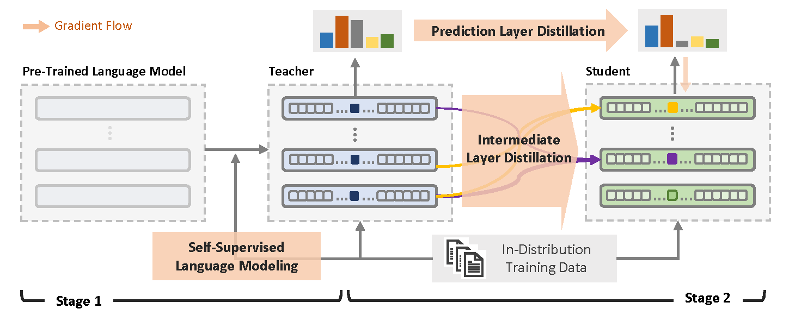

# Multi-Level Knowledge Distillation for Out-of-Distribution Detection in Text

This repository contains the open-sourced official implementation of the paper:

[Multi-Level Knowledge Distillation for Out-of-Distribution Detection in Text](https://aclanthology.org/2023.acl-long.403/) (ACL 2023).

_Qianhui Wu, Huiqiang Jiang, Haonan Yin, Börje F. Karlsson and Chin-Yew Lin_

If you find this repo helpful, please cite the following paper:

```bibtex
@inproceedings{wu-etal-2023-multi,
    title = "Multi-Level Knowledge Distillation for Out-of-Distribution Detection in Text",
    author = "Qianhui Wu, Huiqiang Jiang, Haonan Yin, Börje F. Karlsson and Chin-Yew Lin",
    booktitle = "Proceedings of the 61st Annual Meeting of the Association for Computational Linguistics (Volume 1: Long Papers)",
    month = jul,
    year = "2023",
    publisher = "Association for Computational Linguistics",
    url = "https://aclanthology.org/2023.acl-long.403",
    pages = "7317--7332",
}
```

For any questions/comments, please feel free to open GitHub issues.

## 🎥 Overview

Self-supervised representation learning has proved to be a valuable component for out-of-distribution (OoD) detection with only the texts of in-distribution (ID) examples. These approaches either train a language model from scratch or fine-tune a pre-trained language model using ID examples, and then take perplexity as output by the language model as OoD scores. In this paper, we analyse the complementary characteristics of both OoD detection methods and propose a multi-level knowledge distillation approach to integrate their strengths, while mitigating their limitations. Specifically, we use a fine-tuned model as the teacher to teach a randomly initialized student model on the ID examples. Besides the prediction layer distillation, we present a similarity-based intermediate layer distillation method to facilitate the student’s awareness of the information flow inside the teacher’s layers. In this way, the derived student model gains the teacher’s rich knowledge about the ID data manifold due to pre-training, while benefiting from seeing only ID examples during parameter learning, which promotes more distinguishable features for OoD detection. We conduct extensive experiments over multiple benchmark datasets, i.e., CLINC150, SST, 20 NewsGroups, and AG News; showing that the proposed method yields new state-of-the-art performance.



## 🎯 Quick Start

### Requirements

- python 3.9
- pytorch 1.9.0+cu111
- [HuggingFace Transformers 4.20.0](https://github.com/huggingface/transformers)

Other pip package show in `requirements.txt`.

```bash
pip3 install -r requirements.txt
```

The code may work on other python and pytorch version. However, all experiments were run in the above environment.

### Train and Evaluate

For _Linux_ machines,

```bash
# For single datasets, e.g. CLINC150, SST.
bash scripts/{TASK}/run_clm.sh {seed} {device_id} # bash scripts/HC3/run_clm.sh 171 0
bash scripts/{TASK}/run_kd_clm.sh {seed} {device_id} # bash scripts/HC3/run_kd_clm.sh 171 0

# For datasets group, e.g. ag, 20ng.
bash scripts/{TASK}/run_clm.sh {seed} {device_id} {sub_task}
bash scripts/{TASK}/run_kd_clm.sh {seed} {device_id} {sub_task}
```

## 🍯 Datasets

We use the following widely-used benchmark datasets for the experiments:

- HC3 [Guo wt al., 2023](https://arxiv.org/abs/2301.07597) for human and ChatGPT ansewer dataset;
- CLINIC150 [Larson et al., 2019](https://aclanthology.org/D19-1131/), SST [Socher et al., 2013](https://aclanthology.org/D13-1170/), ROSTD [Gangal et al., 2020](https://arxiv.org/abs/1912.12800), 20NewsGroup [Lang et al., 1995](https://www.sciencedirect.com/science/article/abs/pii/B9781558603776500487), and AG News [Zhang et al., 2015](https://arxiv.org/abs/1509.01626) for OoD detection datasets;

You can generate the HC3 dataset by using the script.

```bash
python scripts/HC3/data_generator.py
```

## 📋 Results

We report the OoD detection results of the proposed MLKD methods, alongside those reported by prior state-of-the-art methods.

### CLNIC150, SST, ROSTD

| Method                | CLINC150     | -            |              | SST          | -            |              | ROSTD -      | -            |              |
| --------------------- | ------------ | ------------ | ------------ | ------------ | ------------ | ------------ | ------------ | ------------ | ------------ |
| -                     | AUROC        | AUPR         | FAR95        | AUROC        | AUPR         | FAR95        | AUROC        | AUPR         | FAR95        |
| TF-IDF+SVD[1]         | 58.5         | 21.8         | -            | 78.0         | 73.2         | -            | -            | -            | -            |
| Likelihood Ratios [2] | -            | -            | -            | -            | -            | -            | 96.35 ± 0.41 | 93.44 ± 0.37 | 20.10 ± 5.25 |
| MDF+IMLM[1]           | 77.8         | 39.1         | -            | 93.6         | 89.4         | -            | -            | -            | -            |
| MDF+IMLM              | 77.46 ± 0.33 | 39.23 ± 0.52 | 65.87 ± 1.13 | 96.79 ± 0.06 | 95.62 ± 0.06 | 11.68 ± 0.41 | 97.71 ± 0.10 | 93.00 ± 0.32 | 9.03 ± 0.43  |
| DATE                  | 83.38 ± 0.15 | 50.21 ± 0.18 | 66.67 ± 1.65 | 82.20 ± 0.18 | 83.11 ± 0.41 | 55.26 ± 1.97 | 96.59 ± 0.43 | 91.77 ± 1.06 | 17.06 ± 1.82 |
| M finetune            | 89.76 ± 0.13 | 62.39 ± 0.29 | 33.77 ± 0.91 | 92.67 ± 0.19 | 91.93 ± 0.17 | 33.67 ± 1.21 | 98.67 ± 0.04 | 97.47 ± 0.09 | 6.27 ± 0.30  |
| M fromScratch         | 91.73 ± 0.12 | 68.78 ± 0.62 | 28.31 ± 0.40 | 96.60 ± 0.65 | 96.42 ± 0.63 | 17.98 ± 3.47 | 99.10 ± 0.03 | 98.25 ± 0.06 | 3.88 ± 0.22  |
| **Ours**              | 92.51 ± 0.18 | 70.94 ± 0.78 | 27.16 ± 0.65 | 97.97 ± 0.40 | 97.81 ± 0.42 | 9.50 ± 2.09  | 99.14 ± 0.03 | 98.33 ± 0.06 | 3.79 ± 0.11  |

[1], [2] represents results reported in Xu et al. (2021) and Gangal et al. (2020), respectively.

### 20NewsGroups

| Method        | comp         | -            | -            | rec          | -            | -            | sci          | -            | -            |
| ------------- | ------------ | ------------ | ------------ | ------------ | ------------ | ------------ | ------------ | ------------ | ------------ |
| -             | AUROC        | AUPR         | FAR95        | AUROC        | AUPR         | FAR95        | AUROC        | AUPR         | FAR95        |
| IsoForest [3] | 66.1         | -            | -            | 59.4         | -            | -            | 57.8         | -            | -            |
| OCSVM [3]     | 78.0         | -            | -            | 70.0         | -            | -            | 64.2         | -            | -            |
| CVDD [3]      | 74.0         | -            | -            | 60.6         | -            | -            | 58.2         | -            | -            |
| DATE [3]      | 92.1         | -            | -            | 83.4         | -            | -            | 69.7         | -            | -            |
| DATE          | 92.04 ± 0.14 | 97.05 ± 0.38 | 46.56 ± 1.37 | 83.09 ± 0.22 | 95.46 ± 0.74 | 65.62 ± 2.17 | 66.30 ± 0.16 | 90.64 ± 0.12 | 81.68 ± 0.67 |
| MDF + IMLM    | 86.37 ± 0.12 | 94.08 ± 0.08 | 53.33 ± 0.36 | 75.77 ± 0.25 | 90.63 ± 0.13 | 69.63 ± 0.25 | 67.02 ± 0.12 | 87.81 ± 0.10 | 86.18 ± 0.68 |
| M finetune    | 87.60 ± 0.22 | 95.14 ± 0.09 | 54.98 ± 0.88 | 74.41 ± 0.25 | 92.45 ± 0.06 | 73.04 ± 0.31 | 63.15 ± 0.24 | 88.89 ± 0.11 | 86.21 ± 0.34 |
| M fromScratch | 91.29 ± 0.60 | 97.29 ± 0.11 | 49.36 ± 5.08 | 85.36 ± 0.56 | 96.27 ± 0.12 | 64.28 ± 3.66 | 67.80 ± 0.23 | 90.40 ± 0.16 | 85.12 ± 0.23 |
| **Ours**      | 92.41 ± 0.22 | 97.49 ± 0.12 | 43.30 ± 1.55 | 87.68 ± 0.15 | 96.79 ± 0.08 | 54.66 ± 1.41 | 69.83 ± 0.29 | 91.14 ± 0.15 | 84.95 ± 0.54 |

| Method        | misc         | -            | -            | pol          | -            | -            | rel          | -            | -            |
| ------------- | ------------ | ------------ | ------------ | ------------ | ------------ | ------------ | ------------ | ------------ | ------------ |
| -             | AUROC        | AUPR         | FAR95        | AUROC        | AUPR         | FAR95        | AUROC        | AUPR         | FAR95        |
| IsoForest [3] | 62.4         | -            | -            | 65.3         | -            | -            | 71.4         | -            | -            |
| OCSVM [3]     | 62.1         | -            | -            | 76.1         | -            | -            | 78.9         | -            | -            |
| CVDD [3]      | 75.7         | -            | -            | 71.5         | -            | -            | 78.1         | -            | -            |
| DATE [3]      | 86.0         | -            | -            | 81.9         | -            | -            | 86.1         | -            | -            |
| DATE          | 82.25 ± 0.12 | 98.93 ± 0.01 | 66.81 ± 2.40 | 81.74 ± 0.16 | 96.72 ± 0.10 | 64.52 ± 2.72 | 86.14 ± 0.09 | 97.66 ± 0.02 | 62.86 ± 0.93 |
| MDF + IMLM    | 62.26 ± 7.70 | 96.80 ± 0.81 | 92.81 ± 5.10 | 81.05 ± 0.16 | 95.48 ± 0.06 | 62.38 ± 0.31 | 80.85 ± 0.26 | 96.14 ± 0.08 | 65.14 ± 0.35 |
| M finetune    | 83.27 ± 0.11 | 98.93 ± 0.02 | 56.28 ± 0.72 | 75.37 ± 0.33 | 95.42 ± 0.09 | 71.32 ± 0.44 | 75.75 ± 0.27 | 95.82 ± 0.07 | 75.53 ± 0.49 |
| M fromScratch | 85.01 ± 0.25 | 99.16 ± 0.01 | 63.56 ± 2.00 | 87.53 ± 0.17 | 97.87 ± 0.01 | 51.32 ± 0.62 | 86.48 ± 0.18 | 97.90 ± 0.06 | 58.57 ± 1.23 |
| **Ours**      | 89.02 ± 0.24 | 99.35 ± 0.03 | 44.66 ± 0.73 | 88.47 ± 0.15 | 98.11 ± 0.04 | 50.85 ± 1.07 | 87.51 ± 0.11 | 98.01 ± 0.03 | 55.74 ± 0.92 |

[3] represents results reported in Manolache et al. (2021).

### HC3

| -                        | AUROC | AUPR  | FAR95 |
| ------------------------ | ----- | ----- | ----- |
| Unsupervised methods:    |       |       |       |
| DATE                     | 75.80 | 91.20 | 85.15 |
| MDF+IMLM (BERT)          | 89.61 | 96.80 | 42.35 |
| MDF+IMLM (GPT2-small)    | 91.53 | 92.56 | 31.84 |
| Ours                     | 99.80 | 99.95 | 0.61  |
| Supervised method:       |       |       |       |
| chatgpt-detector-roberta | 99.98 | 99.99 | 0.04  |

## Contributing

This project welcomes contributions and suggestions. Most contributions require you to agree to a
Contributor License Agreement (CLA) declaring that you have the right to, and actually do, grant us
the rights to use your contribution. For details, visit https://cla.opensource.microsoft.com.

When you submit a pull request, a CLA bot will automatically determine whether you need to provide
a CLA and decorate the PR appropriately (e.g., status check, comment). Simply follow the instructions
provided by the bot. You will only need to do this once across all repos using our CLA.

This project has adopted the [Microsoft Open Source Code of Conduct](https://opensource.microsoft.com/codeofconduct/).
For more information see the [Code of Conduct FAQ](https://opensource.microsoft.com/codeofconduct/faq/) or
contact [opencode@microsoft.com](mailto:opencode@microsoft.com) with any additional questions or comments.
